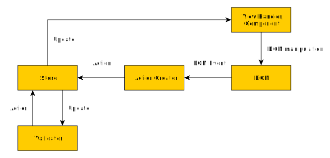

# How to create a validated interactive form

This document describes how to set up the JavaScript features of fundraising forms.

## Architecture

Forms use the [Redux][redux] library to handle events and store **internal state**. Internal state can be the form values,
the validity of those values, validation messages, which parts are displayed and hidden, etc. All the state is kept in
the **Store**. To change the state, an **Action** is dispatched to the store, where it is handled by **Reducers** -
[pure functions][pure_function] that have an initial state and the action as input and a changed state as output.

**Form components** are wrappers for form fields that send the form field value to the store with a `CHANGE_CONTENT` action 
and set the form field value when they receive form content updates from the store. This ensures that the store always 
has the current form field values and that form fields that are duplicated across form pages are in sync.  

The **view handler** classes are listening to changes in the state and update the HTML. They are more diverse than 
form components and do not dispatch actions.  

**Validators** are also listening to changes in the state. If a value changes, they call a validation function and
dispatch a "validation finished" action to the store, which then stores the validation result and validation error
messages with its reducers. The changed validation state may trigger other view handlers.



### Reasons for this architecture
- Redux allows for a clear data flow and a central storage of form state instead of state storage that's tied directly to the DOM.
- We use view handlers and components instead of component libraries like [React][react] or [Vue][vue] because the view handlers can
  decouple HTML manipulation from the actual markup. When the markup changes, view handlers and components can be reused.

## Initializing the form

The library that provides the `WMDE` namespace object must be present (included with a `<script>` tag). See the README on how to generate the library file.

In the form code, insert the following skeleton object. Its empty functions will be filled in the following sections.

```JavaScript
var FormFactory = {
        connectElementEventsToActions: function ( store, actions ) {
            // TODO insert code here
        },
        newValidators: function () {
            return [
                // TODO insert validators here
            ];
        },
        connectValidatorsToStore: function ( store ) {
            WMDE.ReduxValidation.createValidationDispatcherCollection( store, this.newValidators() );
        },
        newViewHandlers: function () {
            return {
                // TODO insert view handlers here
            };
        },
        connectViewHandlersToStore: function ( store ) {
            var viewHandlers = this.newViewHandlers();
            store.subscribe( function() {
                var state = store.getState();
                    // TODO call update methods of view handlers here
            } );
        },
        newComponents: function ( store ) {
            return [
                // TODO insert form components here
            ];
        },
        connectComponentsToStore: function ( store ) {
             var components = this.newComponents( store );
             store.subscribe( function() {
                var state = store.getState(),
                    formContent = state.formContent;

                // TODO check if formContent has changed before executing update actions
                components.map( function ( component ) {
                    component.render( formContent );
                } );

            } );
        },
        init: function ( store, actions ) {
            this.connectElementEventsToActions( store, actions );
            this.connectValidatorsToStore( store );
            this.connectComponentsToStore( store, actions );
            this.connectViewHandlersToStore( store );
        }
    };

FormFactory.init( WMDE.Store, WMDE.Actions );
```

The `init` method should only be called when the document has fully loaded.

### Setting up form components

For every form input element (or group for elements in case of checkboxes and radio buttons), set up a form component 
in the method body of `newComponents`:
 
```JavaScript
newComponents: function ( store ) {
    return [
        WMDE.Components.createRadioComponent( store, $( '.payment-type-select' ), 'paymentType' ),
        WMDE.Components.createTextComponent( store, $( '.first-name' ), 'firstName' )
    ];
},
```

The second argument to the factory function is a jQuery object for the form field. The third argument to the factory 
function is the key for storing the value in the global state (as part of the `formContent` object).

You can find all the available components in [`app/js/lib/form_components.js`](../app/js/lib/form_components.js).

### Connecting user events and form values to actions
Fill the `connectElementEventsToActions` method body with code that binds DOM events to Redux actions. 
Only connect DOM events that aren't handled by the form components. You can find all the available actions in
[`app/js/lib/actions.js`](../app/js/lib/actions.js).

```JavaScript
connectElementEventsToActions: function( store, actions ) {
     $( '#donation-submit1 button' ).click( function () {
        store.dispatch( actions.newNextPageAction() );
    } );
},
```

The `newNextPageAction` function is an **Action Creator** - a function that makes sure the correct action object is created
correctly. Many actions have **payloads** - data that will be processed by the reducer functions. 
The payload given through the parameters of the action creator.

### Setting up validation

Fill the `newValidators` method body with instances of `ValidationDispatcher` classes. A `ValidationDispatcher` calls a validation function with values from the store and dispatches an action to store the validation result. It only does this when the values from the store change.

The `createValidationDispatcher` factory function has three arguments:

1. The **validation function** to call. The function has to have one parameter - an object of the values to validate. The "validation function" argument can also be an object that has a `validate` method.
2. The action creator to call with the validation result.
3. An array of field names from the `formContent` part of the global store. The field names will be used to construct the value object for the validation function.

```JavaScript
newValidators: function() {
    return [
        WMDE.ReduxValidation.createValidationDispatcher(
            WMDE.FormValidation.createAmountValidator( '{$ basepath $}/validate-amount' ),
            WMDE.Actions.newFinishAmountValidationAction,
            [ 'amount', 'paymentType' ]
        )
    ];
},
```

Actions names for storing validation results should follow the naming pattern of `FINISH_XXX_VALIDATION`.

You can find available validation functions and classes in [`app/lib/form_validation.js`](../app/lib/form_validation.js)

### Setting up the view handlers

First, you need to connect the view handlers to actual DOM elements in the `newViewHandlers` method:

```JavaScript
newViewHandlers: function() {
    return {
        formPageHighlight: WMDE.View.createFormPageHighlightHandler( $( 'ul.step-list li' ) ),
        clearAmount: WMDE.View.createClearAmountHandler( $( 'input[name=betrag_auswahl]' ), $( '#amount-8' ) )
    };
},
```

For a list of available view handlers see the [`app/js/lib/view_handlers`](../app/js/lib/view_handlers) directory.

The `update` method of each view handler needs to be connected to the correct part of the global state. This is done in the `connectViewHandlersToStore` method:

```JavaScript
connectViewHandlersToStore: function ( store ) {
    var viewHandlers = this.newViewHandlers();
    store.subscribe( function() {
        var state = store.getState();
        viewHandlers.formPageHighlight.update( state.formPagination );
        viewHandlers.clearAmount.update( state.formContent );
    } );
},
```

[redux]: http://redux.js.org/
[pure_function]: https://en.wikipedia.org/wiki/Pure_function
[react]: https://facebook.github.io/react/
[vue]: http://vuejs.org/
