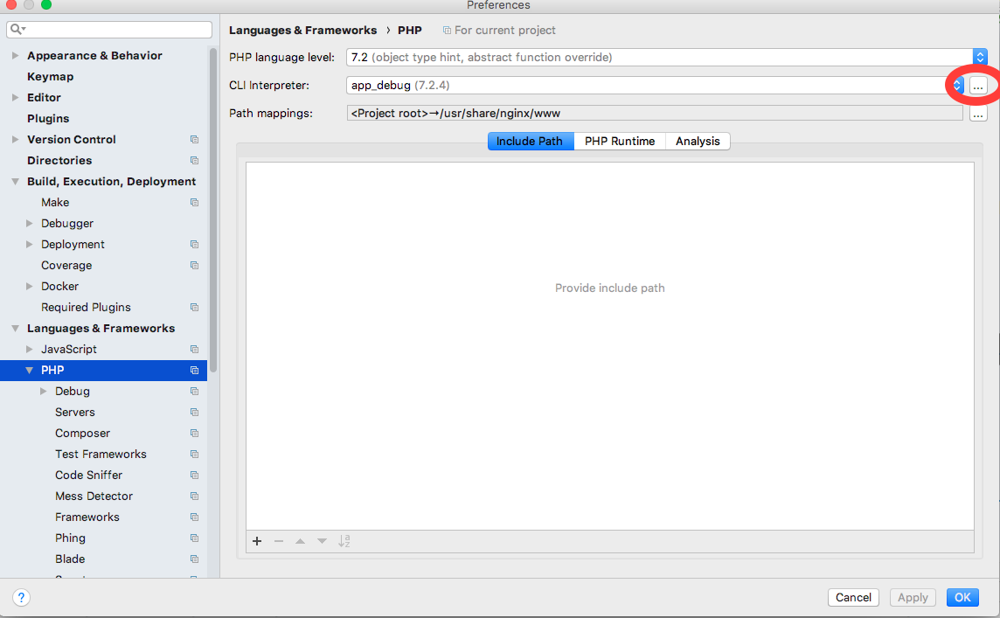
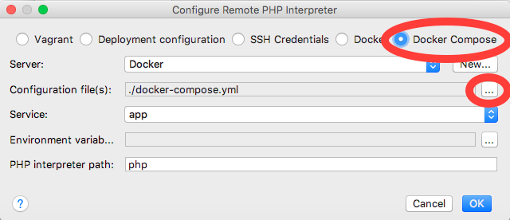
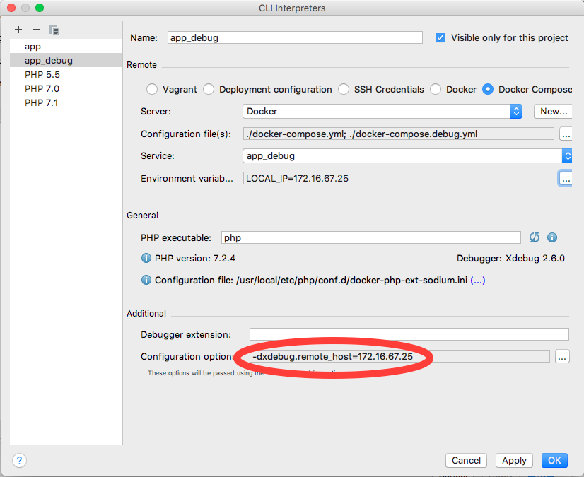
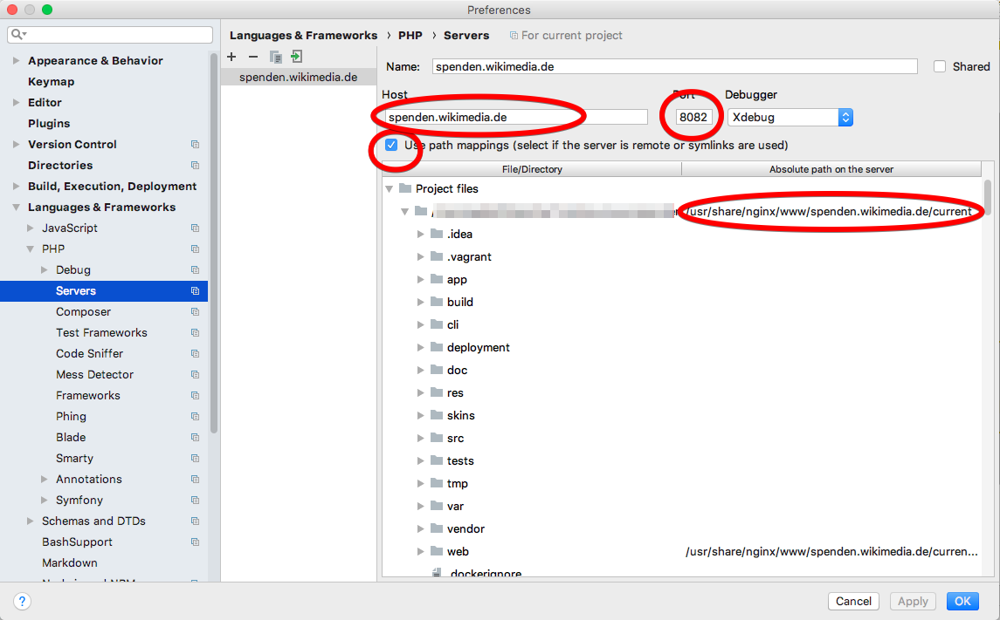
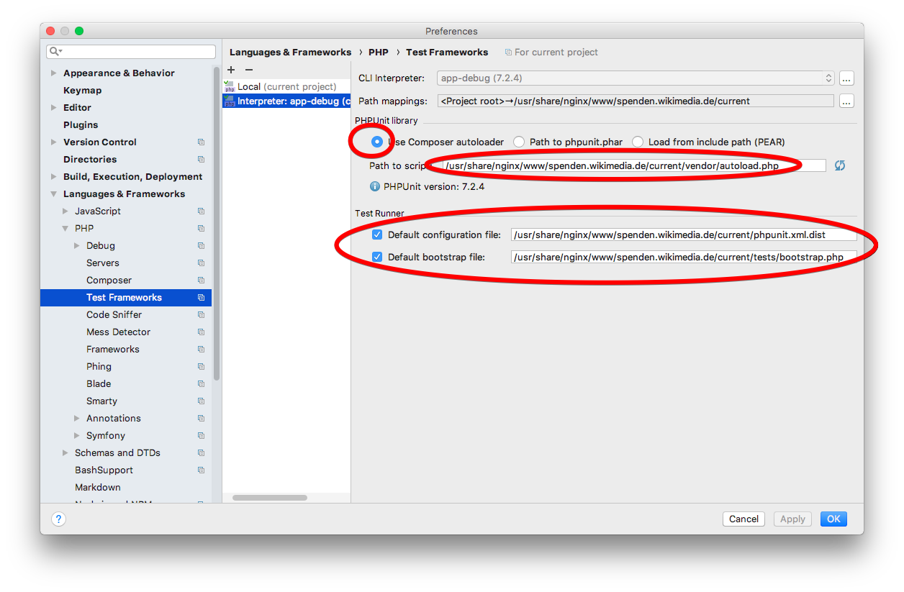

# How to use XDebug in the Docker environment with PHPStorm

To know more about how the setup works without PHPStorm, see the [setup instructions from the playground](https://github.com/gbirke/php-xdebug-phpstorm-playground/blob/master/docs/SETUP.md)

## Create .env file

Find out the IP address of your computer and put in in the file `.env`, at the same level of `docker-compose.yml`, with the following contents:

    LOCAL_IP=<YOUR_IP_ADDRESS>

## Install the required PHPStorm Plugins
In the "Plugins" section of the PHPStorm preferences make sure that you have installed the following Plugins:
* Docker Integration
* PHP Docker
* PHP Remote Interpreter

## Configure the PHP remote interpreter
In the PHPStorm preferences, go to "Languages & Frameworks -> PHP". Click on the three dots for the "CLI interpreter".

A dialog with the configured interpreters will pop up. Click on the plus sign in the upper left to add a new remote interpreter. Choose "Docker Compose". Click on the three dots for "Configuration file(s)" and add the `docker-compose.debug.yml` file. After that, you can choose the container name with XDebug in it. For the example project it's `app_debug`.

After you clicked "OK", the interpreter will show up in the list of interpreters. To get around the bugs of [PHPStorm overriding the XDEBUG_CONFIG setting](https://youtrack.jetbrains.com/issue/WI-38329) and [PHPStorm not setting environment variables](https://youtrack.jetbrains.com/issue/WI-41043), you need to add a custom configuration setting in the "Configuration options". Click on the three dots and enter `xdebug.remote_host` as name and your IP address as value.

To switch between environments you can add another interpreter that uses `docker-compose.yml` without `docker-compose.debug.yml`.

## Add the server name
You need to add the server name you configured in `PHP_IDE_CONFIG` the NGinX configuration. In the PHPStorm preferences, go to "Languages & Frameworks -> PHP -> Server". Click the plus sign in the upper left corner to create a new server.

Enter `spenden.wikimedia.de` as the server name, `8082` as the port and check the "Use Path mappings" box. Map your local path to `/usr/share/nginx/www/spenden.wikimedia.de/current/`

## Add PHPUnit configuration
In the PHPStorm preferences, go to "Languages & Frameworks -> PHP -> Testing Framework". Click the plus sign in the upper left corner to create a new PHPUnit configuration. Choose "PHPUnit by remote interpreter". After you created it, make sure that the path mapping is correct, check "Use Composer autoloader" and check if the "Path to script" points to the path-mapped autoloader file.

Also check the "Default configuration file" and use the path `/usr/share/nginx/www/spenden.wikimedia.de/current/phpunit.xml.dist`

## Testing the PHPStorm setup

First, choose "Run -> Start Listening to XDebug Connections" from the PHPStorm menu.

To test XDebug in the server environment, start the environment on the command line and add a breakpoint in your code. Go to the web site and see if the execution stops at the breakpoint.

To test XDebug in the CLI/PHPUnit environment, open a runnable PHP file (unit test or CLI command), set a breakpoint in your code and choose "Debug" from its context menu.
